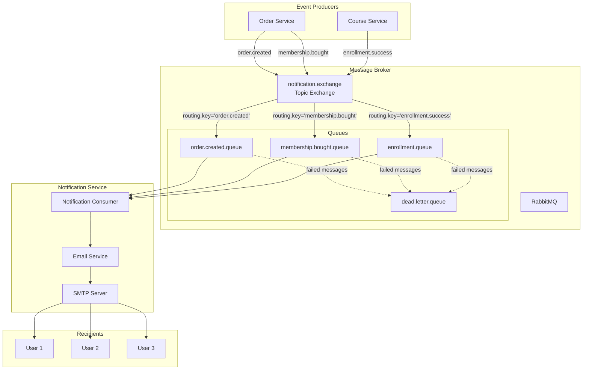
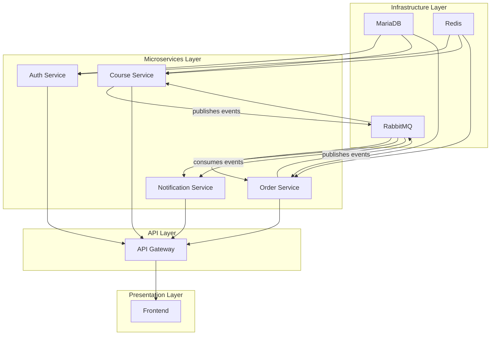

# Design Document: RabbitMQ + Notification Service

## Overview

The RabbitMQ + Notification Service is a critical component of the online learning platform that provides asynchronous email notification capabilities. The system uses RabbitMQ as a message broker to decouple event producers (Order Service, Course Service) from the notification processing logic, ensuring reliable email delivery even during high load or service disruptions.

### Key Design Goals
1. **Reliability**: Ensure email notifications are delivered even during partial system failures
2. **Scalability**: Handle increasing event volumes without impacting core business services
3. **Maintainability**: Clear separation of concerns between event publishing, message routing, and email delivery
4. **Observability**: Comprehensive monitoring and logging for troubleshooting and system health

### System Context
- **Producers**: Order Service (order.created, membership.bought), Course Service (enrollment.success)
- **Message Broker**: RabbitMQ with topic exchange routing
- **Consumer**: Notification Service with email delivery capabilities
- **External Dependencies**: SMTP email service (Gmail), MariaDB (optional for persistence)

## Architecture

### High-Level Architecture Diagram



### Data Flow
1. **Event Generation**: Order/Course services publish events to RabbitMQ exchange
2. **Message Routing**: RabbitMQ routes messages to appropriate queues based on routing keys
3. **Event Consumption**: Notification Service consumes messages from queues
4. **Email Processing**: Extracts event data, formats email content, sends via SMTP
5. **Delivery Confirmation**: Email delivered to user inbox
6. **Error Handling**: Failed messages moved to dead letter queue for manual intervention

### Docker Compose Architecture



## Components and Interfaces

### 1. RabbitMQ Infrastructure Component

**Responsibilities**:
- Message routing and delivery between services
- Queue persistence and durability
- Dead letter queue management
- Connection management for producers and consumers

**Configuration**:
```yaml
# docker-compose.yml addition
rabbitmq:
  image: rabbitmq:3.13-management
  container_name: rabbitmq
  ports:
    - "5672:5672"    # AMQP protocol
    - "15672:15672"  # Management UI
  environment:
    RABBITMQ_DEFAULT_USER: guest
    RABBITMQ_DEFAULT_PASS: guest
  volumes:
    - rabbitmq_data:/var/lib/rabbitmq
  healthcheck:
    test: ["CMD", "rabbitmq-diagnostics", "ping"]
    interval: 30s
    timeout: 10s
    retries: 5
```

### 2. Notification Service Component

**Responsibilities**:
- Consume events from RabbitMQ queues
- Process event data and format email content
- Send emails via SMTP with retry logic
- Handle errors and dead letter queue management
- Provide health monitoring endpoints

**Key Classes**:
- `RabbitMQConfig`: Exchange, queue, and binding configuration
- `NotificationConsumer`: Event consumption and processing
- `EmailService`: Email formatting and SMTP delivery
- `EventDTOs`: Data transfer objects for event serialization

### 3. Event Publisher Components (Order/Course Services)

**Responsibilities**:
- Publish events to RabbitMQ exchange
- Serialize event data to JSON
- Handle publishing failures with retry logic
- Ensure event idempotency

**Key Classes**:
- `EventPublisher`: Generic event publishing utility
- `OrderCreatedEvent`, `MembershipBoughtEvent`, `EnrollmentEvent`: Event DTOs
- `RabbitMQConfig`: Producer-side configuration

### 4. Email Service Component

**Responsibilities**:
- Format HTML email templates with dynamic content
- Send emails via configured SMTP server
- Handle SMTP connection failures and retries
- Log email delivery status
- Support multiple email templates for different event types

## Data Models

### Event Data Models

```java
// Order Created Event
public class OrderCreatedEvent {
    private String orderId;
    private String userId;
    private String userEmail;
    private String userName;
    private List<OrderItem> items;
    private BigDecimal totalAmount;
    private String paymentMethod;
    private LocalDateTime orderDate;
}

// Membership Bought Event  
public class MembershipBoughtEvent {
    private String membershipId;
    private String userId;
    private String userEmail;
    private String userName;
    private String membershipName;
    private Integer durationMonths;
    private BigDecimal price;
    private LocalDate startDate;
    private LocalDate endDate;
}

// Enrollment Event
public class EnrollmentEvent {
    private String enrollmentId;
    private String userId;
    private String userEmail;
    private String userName;
    private String courseId;
    private String courseName;
    private String instructorName;
    private LocalDateTime enrollmentDate;
}
```

### Queue Configuration Model

```java
public class QueueConfig {
    private String exchangeName;      // "notification.exchange"
    private String queueName;         // e.g., "order.created.queue"
    private String routingKey;        // e.g., "order.created"
    private boolean durable;          // true for persistent queues
    private boolean exclusive;        // false for shared queues
    private boolean autoDelete;       // false for permanent queues
    private Map<String, Object> arguments; // TTL, DLQ config
}
```

### Email Template Model

```java
public class EmailTemplate {
    private String templateName;      // "order-confirmation", "membership-confirmation", "enrollment-confirmation"
    private String subject;           // Email subject with placeholders
    private String htmlContent;       // HTML template with placeholders
    private Map<String, Object> variables; // Template variables
}
```

## Correctness Properties

*A property is a characteristic or behavior that should hold true across all valid executions of a system—essentially, a formal statement about what the system should do. Properties serve as the bridge between human-readable specifications and machine-verifiable correctness guarantees.*

### Property 1: Event Serialization Round-Trip

*For any* valid event object (OrderCreatedEvent, MembershipBoughtEvent, or EnrollmentEvent), serializing it to JSON then deserializing back to the same event type should produce an equivalent object with all fields preserved.

**Validates: Requirements 8.4**

### Property 2: Email Template Variable Substitution

*For any* email template and any valid set of template variables, substituting variables into the template should produce a valid HTML email with all placeholders replaced and no missing variables.

**Validates: Requirements 4.1, 4.2, 4.3, 4.4**

### Property 3: Currency Formatting Consistency

*For any* monetary amount in VND, formatting it for email display should produce a string with proper thousand separators, no decimal places for whole amounts, and consistent formatting across all email types.

**Validates: Requirements 4.5**

### Property 4: Queue Message Processing Idempotence

*For any* RabbitMQ message delivered to the notification service, processing the same message multiple times (in case of redelivery) should not result in duplicate email notifications to the same recipient.

**Validates: Requirements 3.7**

### Property 5: Dead Letter Queue Forwarding

*For any* message that fails processing after the maximum retry attempts, the system should move the message to the dead letter queue with preserved message content and error metadata.

**Validates: Requirements 3.6, 7.1**

### Property 6: Connection Retry Exponential Backoff

*For any* failed connection attempt to RabbitMQ or SMTP server, subsequent retry attempts should follow an exponential backoff pattern with increasing delay between attempts.

**Validates: Requirements 2.6, 4.7, 7.2, 7.4**

### Property 7: Health Check Completeness

*For any* system state, the health check endpoint should accurately reflect the status of all critical dependencies (RabbitMQ connection, SMTP connectivity, internal service health).

**Validates: Requirements 6.4, 6.5**

## Error Handling

### 1. RabbitMQ Connection Failures
- **Detection**: Connection timeout or channel closure
- **Recovery**: Exponential backoff retry (1s, 2s, 4s, 8s, 16s, 32s)
- **Fallback**: Circuit breaker pattern after 5 consecutive failures
- **Alerting**: Log error and trigger health check failure

### 2. Email Delivery Failures
- **Detection**: SMTP exception or timeout
- **Recovery**: 3 retry attempts with 30-second intervals
- **Fallback**: Move to dead letter queue after max retries
- **Alerting**: Log detailed error with recipient and template info

### 3. Event Processing Failures
- **Detection**: JSON parsing error or missing required fields
- **Recovery**: Immediate rejection with error logging
- **Fallback**: Move to dead letter queue with error context
- **Alerting**: Log parsing error with message content

### 4. Memory and Resource Issues
- **Detection**: High memory usage or thread pool exhaustion
- **Recovery**: Backpressure via RabbitMQ prefetch limit
- **Fallback**: Graceful degradation - process fewer messages
- **Alerting**: Monitor queue depths and consumer lag

### Dead Letter Queue Strategy
```yaml
dead-letter-exchange: "notification.dlx"
dead-letter-routing-key: "dead.letter"
message-ttl: 86400000  # 24 hours
max-retry-attempts: 3
```

## Testing Strategy

### Unit Testing
- **Event Serialization**: Test JSON serialization/deserialization round-trip
- **Email Templates**: Test variable substitution and HTML validation
- **Currency Formatting**: Test VND formatting with various amounts
- **Configuration Validation**: Test property loading and validation

### Integration Testing
1. **RabbitMQ Integration**: Test message publishing and consumption
2. **SMTP Integration**: Test email sending with test SMTP server
3. **End-to-End Flow**: Test complete flow from event publish to email delivery
4. **Error Scenarios**: Test connection failures and recovery

### Property-Based Testing
Given the nature of this system (message processing, serialization, formatting), property-based testing is highly applicable:

**Test Framework**: JUnit 5 + QuickTheories (Java property-based testing)
**Configuration**: 100 iterations per property test
**Test Categories**:
1. **Serialization Properties**: Round-trip correctness for all event types
2. **Formatting Properties**: Consistent formatting across inputs
3. **Idempotence Properties**: Duplicate message handling
4. **Error Handling Properties**: Failure recovery behavior

### Test Environment Configuration
```yaml
test:
  rabbitmq:
    embedded: true  # Use embedded RabbitMQ for tests
    port: 5673
  smtp:
    embedded: true  # Use GreenMail for test SMTP
    port: 3025
  email:
    test-recipient: "test@example.com"
```

### Monitoring and Observability Tests
- **Health Check Tests**: Verify all dependencies are monitored
- **Metrics Collection**: Test counter and gauge metrics
- **Logging Tests**: Verify structured logging with correlation IDs

## Deployment Configuration

### Docker Compose Configuration
```yaml
# Add to existing docker-compose.yml
rabbitmq:
  image: rabbitmq:3.13-management
  container_name: rabbitmq
  ports:
    - "5672:5672"
    - "15672:15672"
  environment:
    RABBITMQ_DEFAULT_USER: guest
    RABBITMQ_DEFAULT_PASS: guest
  volumes:
    - rabbitmq_data:/var/lib/rabbitmq
  healthcheck:
    test: ["CMD", "rabbitmq-diagnostics", "ping"]
    interval: 30s
    timeout: 10s
    retries: 5

notification-service:
  build: ./notification-service
  container_name: notification-service
  ports:
    - "8084:8084"
  depends_on:
    rabbitmq:
      condition: service_healthy
  environment:
    SPRING_RABBITMQ_HOST: rabbitmq
    SPRING_RABBITMQ_PORT: 5672
    SPRING_RABBITMQ_USERNAME: guest
    SPRING_RABBITMQ_PASSWORD: guest
    SPRING_MAIL_HOST: ${SMTP_HOST:-smtp.gmail.com}
    SPRING_MAIL_PORT: ${SMTP_PORT:-465}
    SPRING_MAIL_USERNAME: ${SMTP_USERNAME}
    SPRING_MAIL_PASSWORD: ${SMTP_PASSWORD}
  healthcheck:
    test: ["CMD-SHELL", "curl -f http://localhost:8084/actuator/health || exit 0"]
    interval: 30s
    timeout: 10s
    retries: 3
    start_period: 40s
  env_file:
    - .env

volumes:
  rabbitmq_data:
```

### Environment Variables
```properties
# .env file
SMTP_HOST=smtp.gmail.com
SMTP_PORT=465
SMTP_USERNAME=your-email@gmail.com
SMTP_PASSWORD=your-app-password
PLATFORM_NAME=Online Learning Platform
SENDER_EMAIL=noreply@onlinelearning.com

# RabbitMQ Configuration (optional overrides)
RABBITMQ_USERNAME=guest
RABBITMQ_PASSWORD=guest
```

### Spring Boot Configuration
```properties
# application.properties
spring.rabbitmq.host=${RABBITMQ_HOST:rabbitmq}
spring.rabbitmq.port=${RABBITMQ_PORT:5672}
spring.rabbitmq.username=${RABBITMQ_USERNAME:guest}
spring.rabbitmq.password=${RABBITMQ_PASSWORD:guest}

# Exchange and Queue Configuration
notification.exchange.name=notification.exchange
notification.queue.order.created=order.created.queue
notification.queue.membership.bought=membership.bought.queue  
notification.queue.enrollment=enrollment.queue

# Email Configuration
spring.mail.host=${SMTP_HOST}
spring.mail.port=${SMTP_PORT}
spring.mail.username=${SMTP_USERNAME}
spring.mail.password=${SMTP_PASSWORD}
spring.mail.properties.mail.smtp.auth=true
spring.mail.properties.mail.smtp.ssl.enable=true

# Platform Configuration
platform.name=${PLATFORM_NAME:Online Learning Platform}
sender.email=${SENDER_EMAIL:noreply@onlinelearning.com}
```

## Monitoring and Observability

### Health Checks
- **/actuator/health**: Overall service health
- **/actuator/health/rabbitmq**: RabbitMQ connection status
- **/actuator/metrics**: Application metrics
- **/actuator/prometheus**: Prometheus metrics endpoint

### Key Metrics
1. **rabbitmq_consumed_messages_total**: Count of messages consumed by type
2. **email_sent_total**: Count of emails sent by template type
3. **email_failed_total**: Count of email delivery failures
4. **processing_duration_seconds**: Histogram of message processing time
5. **queue_depth**: Current queue sizes (from RabbitMQ management API)

### Logging Strategy
- **Structured JSON logging** for machine parsing
- **Correlation IDs** to trace events through the system
- **Log levels**: ERROR for failures, INFO for business events, DEBUG for troubleshooting
- **Sensitive data masking**: Email addresses, passwords in logs

### Alerting Rules
1. **High Failure Rate**: >5% email delivery failures in 5 minutes
2. **Queue Backlog**: >1000 messages in any queue for >10 minutes
3. **Service Unhealthy**: Health check fails for 2 consecutive minutes
4. **High Memory Usage**: >80% heap usage for >5 minutes

## Security Considerations

### 1. Credential Management
- Use environment variables or secret management for SMTP credentials
- Never hardcode credentials in source code or configuration files
- Rotate credentials regularly, especially for production

### 2. Network Security
- Use SSL/TLS for RabbitMQ connections in production
- Restrict network access to RabbitMQ management UI
- Use VPN or private network for inter-service communication

### 3. Data Protection
- Mask sensitive data (email addresses) in logs
- Implement rate limiting to prevent email abuse
- Validate email content to prevent injection attacks

### 4. Compliance
- GDPR compliance for email communication
- CAN-SPAM compliance for commercial emails
- Data retention policies for event logs

## Performance Considerations

### 1. Throughput Optimization
- **Prefetch Count**: Configure appropriate prefetch for consumer throughput
- **Connection Pooling**: Reuse RabbitMQ connections and channels
- **Batch Processing**: Consider batch email sending for high volume

### 2. Resource Management
- **Memory**: Monitor heap usage for large email templates
- **Threads**: Configure thread pools for concurrent processing
- **Network**: Monitor bandwidth for email attachments

### 3. Scalability
- **Horizontal Scaling**: Multiple notification service instances
- **Queue Partitioning**: Shard queues by user or event type
- **Load Balancing**: Use RabbitMQ's built-in load balancing

## Future Enhancements

### 1. Additional Notification Channels
- SMS notifications via Twilio or similar services
- Push notifications for mobile apps
- Webhook notifications for third-party integrations

### 2. Advanced Features
- Email template management UI
- Notification preferences per user
- A/B testing for email templates
- Analytics for email open/click rates

### 3. Infrastructure Improvements
- RabbitMQ clustering for high availability
- Multi-region deployment for disaster recovery
- Advanced monitoring with distributed tracing

### 4. Developer Experience
- Local development with docker-compose
- Integration test utilities
- Documentation and examples